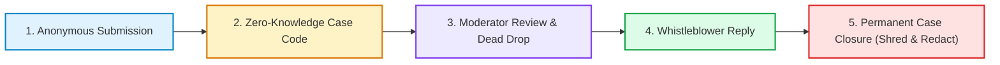

# 🛡️ WhistleDrop

> **Confidential, Zero-Knowledge Anonymous Reporting & Encrypted Dead Drops.**  
> *What if an anonymous reporting system was leaked, but the attacker learned literally nothing?*  
> WhistleDrop provides complete whistleblower anonymity through cryptographic zero-knowledge lookups, in-memory EXIF metadata scrubbing, and automated data minimization on permanent closure.

<div align="center">

[](https://www.python.org/)
[](https://fastapi.tiangolo.com)
[](#-running-tests)
[](#-threat-model--security-architecture)
[-orange.svg)](#-quickstart-in-30-seconds)
[](LICENSE)

[**⚡ 30s Quickstart**](#-quickstart-in-30-seconds) &bull;
[**🎯 2-Minute Evaluator Tour**](#-2-minute-evaluator-tour) &bull;
[**✨ Why WhistleDrop?**](#-why-whistle-drop-vs-traditional-systems) &bull;
[**🛡️ Security Architecture**](#-threat-model--security-architecture) &bull;
[**📖 API & Docs**](#-api-reference)

</div>

---

## ⚡ Quickstart in 30 Seconds

Zero external databases, zero containers required to run locally. Built with Python 3.14, FastAPI, SQLite, and `uv`.

```bash
# 1. Clone repository & install dependencies
git clone https://github.com/libin-codes/whistle-drop.git
cd whistle-drop
uv sync

# 2. Launch the backend server
uv run uvicorn app.main:app --reload
```

Instant access points:
* 🖥️ **Embedded Dashboard (Zero-setup UI)**: [http://localhost:8000](http://localhost:8000)
* 📑 **Interactive Swagger API Docs**: [http://localhost:8000/docs](http://localhost:8000/docs)
* 🧪 **Run 70 Automated Tests**: `uv run pytest` *(completes in < 3s)*

*(Prefer Docker? Run `docker compose up --build` and open [http://localhost:8000](http://localhost:8000))*

---

## 🎯 2-Minute Evaluator Tour

Here is the fastest path to test all core capabilities and security guarantees interactively:



1. **Submit an Anonymous Report**:
   * Open [http://localhost:8000](http://localhost:8000).
   * In the **Whistleblower Submit** tab, select a category (e.g. `CORRUPTION`), enter a description, and optionally attach an image file.
   * Click **Submit Anonymous Report**.
   * Copy the returned cryptographically random **Case Code** (e.g. `WD-K7M2-X9PL`). *This code is returned once and never stored in plaintext.*

2. **Triage as Moderator**:
   * Switch to the **Moderator Portal** tab.
   * Log in using default auto-seeded credentials:
     * **Username:** `moderator`
     * **Password:** `moderator123`
   * Select your report, advance the status to `UNDER_REVIEW`, and post a note or inquiry in the **Dead Drop** thread.

3. **Track as Whistleblower**:
   * Switch to the **Whistleblower Track** tab.
   * Paste your `Case Code`.
   * Observe the real-time status update and reply to the moderator's inquiry anonymously through the Dead Drop.

4. **Verify Permanent Closure & Data Minimization**:
   * In the Moderator Portal, click **Permanently Close Case**.
   * Observe [ADR-0002](docs/adr/0002-permanent-closure-data-minimization.md) in action: the description is irreversibly replaced with `[REDACTED - CASE PERMANENTLY CLOSED]`, the attached evidence file is physically shredded from local disk, and the message thread is frozen against further writes.

5. **Verify the Test Suite**:
   * In your terminal, run `uv run pytest`. All **70 tests** covering crypto hashing, rate limiting, EXIF stripping, and closure immutability pass immediately.

---

## ✨ Why WhistleDrop vs Traditional Systems?

| Capability | Traditional Helpdesks & Forms | WhistleDrop |
|---|---|---|
| **Reporter Identity** | Requires email, account, or IP tracking | **Zero accounts, zero tracking**. Possession of secret Case Code is the sole authenticator. |
| **Database Compromise** | Plaintext tracking IDs reveal case channels | **Zero-Knowledge SHA-256 Storage ([ADR-0001](docs/adr/0001-hashed-case-codes.md))**. Leaked database reveals zero Case Codes. |
| **Evidence Metadata** | Stores raw uploads containing GPS, camera EXIF | **In-Memory Evidence Scrubbing**. EXIF/GPS metadata is stripped in-memory before disk persistence. |
| **Brute-Force Protection** | Often unprotected enumeration | **Sliding-Window Rate Limiter**. Throttles tracking to 10 req/min per IP (~7,000 years to exhaust space). |
| **Case Closure** | Soft deletes or retains sensitive data indefinitely | **Permanent Closure Minimization ([ADR-0002](docs/adr/0002-permanent-closure-data-minimization.md))**. Physical file shredding & description tombstoning. |
| **Two-Way Communication** | Requires user accounts or email chains | **Anonymous Dead Drop Thread**. Bi-directional asynchronous messaging authenticated only by Case Code. |
| **Setup & Evaluation** | Requires Node, Postgres, Redis, complex configs | **Zero-Friction ([ADR-0003](docs/adr/0003-python-fastapi-stack.md))**. Single command launch via `uv` or Docker with embedded SPA dashboard. |

---

## 🛡️ Threat Model & Security Architecture

### 1. Zero-Knowledge Case Codes ([ADR-0001](docs/adr/0001-hashed-case-codes.md))

```
Whistleblower                     WhistleDrop Backend                     Database
    │                                      │                                  │
    │  Submit Report                       │                                  │
    ├─────────────────────────────────────►│  Generate Code: WD-K7M2-X9PL    │
    │                                      │  Hash Code: SHA256(...)          │
    │                                      │─────────────────────────────────►│
    │  Returns Plain Code: WD-K7M2-X9PL    │                                  │ Store ONLY Hash
    │◄─────────────────────────────────────┤                                  │ (Plain code discarded)
    │                                      │                                  │
```

* Plaintext Case Codes (`WD-XXXX-XXXX`, 8 alphanumeric characters = ~41 bits of entropy) are returned to the reporter **once** and never persisted.
* The database stores only the irreversible SHA-256 digest (`Hashed Case Code`).
* Lookups hash the incoming code in-memory. Even if a rogue database administrator dumps the full SQLite database, **they cannot access or view reports without knowing the plaintext Case Code**.

### 2. In-Memory Evidence Scrubbing

```
Uploaded Image (JPEG/PNG/WebP)
┌─────────────────────────────────┐
│ [EXIF: iPhone 15 Pro, GPS Lat/Lng]│
│ [Device Serial, Timestamp]      │
│ [Image Pixel Data]              │
└────────────────┬────────────────┘
                 │ Pillow In-Memory Re-encoding (Zero disk writes of raw file)
                 ▼
Scrubbed File on Disk (/uploads/<uuid>.jpg)
┌─────────────────────────────────┐
│ [Clean Pixel Data ONLY]         │
└─────────────────────────────────┘
```

* All uploaded images undergo validation for allowed MIME types (`image/jpeg`, `image/png`, `image/webp`) and a 5 MB size limit.
* Pillow loads image bytes in-memory and re-encodes pure pixel data, stripping EXIF, GPS coordinates, camera serial numbers, and software signatures before saving to disk with a UUID.

### 3. Data Minimization on Permanent Closure ([ADR-0002](docs/adr/0002-permanent-closure-data-minimization.md))

* Advancing a case to `PERMANENTLY_CLOSED`:
  1. Overwrites report description with standardized Redaction Marker: `[REDACTED - CASE PERMANENTLY CLOSED]`.
  2. Physically unlinks and shreds attached evidence files from disk.
  3. Freezes the Dead Drop message thread against any subsequent messages.
  4. Permanently locks report status (subsequent updates or modifications return `HTTP 400 Bad Request`).

---

## 🏗️ Architecture & Component Design

```
┌────────────────────────────────────────────────────────────────────────┐
│                        WhistleDrop Stack                               │
│                                                                        │
│  ┌────────────────────────┐  ┌──────────────────────────────────────┐  │
│  │ Embedded Dashboard SPA │  │        FastAPI Application           │  │
│  │       (GET /)          │  │                                      │  │
│  └────────────────────────┘  │  ┌──────────┐ ┌───────────┐ ┌──────┐ │  │
│                              │  │ Reports  │ │ Evidence  │ │ Auth │ │  │
│  ┌────────────────────────┐  │  │  Router  │ │  Router   │ │Router│ │  │
│  │ Interactive Swagger UI │  │  └────┬─────┘ └─────┬─────┘ └──┬───┘ │  │
│  │      (GET /docs)       │  │       │             │          │     │  │
│  └────────────────────────┘  │  ┌────┴─────────────┴──────────┴───┐ │  │
│                              │  │        Moderator Router         │ │  │
│                              │  └──────────────────┬──────────────┘ │  │
│                              │                     │                │  │
│                              │  ┌──────────────────┴──────────────┐ │  │
│                              │  │   Domain Services & Validation  │ │  │
│                              │  │ case_codes │ workflow │ rate_lim│ │  │
│                              │  │ evidence   │ auth     │ database│ │  │
│                              │  └──────────────────┬──────────────┘ │  │
│                              │                     │                │  │
│                              │  ┌──────────────────┴──────────────┐ │  │
│                              │  │ SQLite Database (whistledrop.db)│ │  │
│                              │  └─────────────────────────────────┘ │  │
│                              └──────────────────────────────────────┘  │
│                                                                        │
│  ┌──────────────────────────────────────────────────────────────────┐  │
│  │                /uploads/ (Local Scrubbed Evidence Storage)       │  │
│  └──────────────────────────────────────────────────────────────────┘  │
└────────────────────────────────────────────────────────────────────────┘
```

---

## 📖 API Reference

All primary endpoints live under `/api/v1`. Full interactive OpenAPI documentation and live execution is available at [`http://localhost:8000/docs`](http://localhost:8000/docs).

| Method | Endpoint | Access | Purpose |
|---|---|---|---|
| `POST` | `/api/v1/reports` | Anonymous | Submit anonymous report; returns plaintext Case Code once |
| `GET` | `/api/v1/reports/track/{case_code}` | Anonymous (Rate-limited) | Look up report status via zero-knowledge code hash |
| `POST` | `/api/v1/reports/track/{case_code}/messages` | Anonymous (Rate-limited) | Post whistleblower reply to Dead Drop thread |
| `GET` | `/api/v1/reports/track/{case_code}/messages` | Anonymous (Rate-limited) | Retrieve Dead Drop thread for case |
| `POST` | `/api/v1/evidence/upload` | Anonymous | Upload evidence image (automatic EXIF/GPS scrubbing) |
| `POST` | `/api/v1/auth/login` | Public | Authenticate moderator; returns 24h JWT Bearer token |
| `GET` | `/api/v1/moderator/reports` | Moderator (JWT) | List reports with category/status filters & pagination |
| `GET` | `/api/v1/moderator/reports/{id}` | Moderator (JWT) | Retrieve full details for single report |
| `PATCH` | `/api/v1/moderator/reports/{id}/status` | Moderator (JWT) | Advance report through Status Workflow state machine |
| `POST` | `/api/v1/moderator/reports/{id}/messages` | Moderator (JWT) | Post moderator inquiry to report Dead Drop |
| `GET` | `/api/v1/moderator/reports/{id}/messages` | Moderator (JWT) | Read report Dead Drop thread |
| `POST` | `/api/v1/moderator/reports/{id}/close` | Moderator (JWT) | Permanently close case & trigger data minimization |

<details>
<summary><b>📜 Click to view cURL Examples for Key Endpoints</b></summary>

<br>

### 1. Submit an Anonymous Report
```bash
curl -X POST http://localhost:8000/api/v1/reports \
  -H "Content-Type: application/json" \
  -d '{
    "category": "CORRUPTION",
    "description": "Unusual fund transfers identified in Q3 budget allocations."
  }'
```

### 2. Upload Evidence (EXIF-Scrubbed)
```bash
curl -X POST http://localhost:8000/api/v1/evidence/upload \
  -F "file=@screenshot.png"
```

### 3. Track Report Status
```bash
curl http://localhost:8000/api/v1/reports/track/WD-K7M2-X9PL
```

### 4. Moderator Login
```bash
curl -X POST http://localhost:8000/api/v1/auth/login \
  -H "Content-Type: application/json" \
  -d '{"username": "moderator", "password": "moderator123"}'
```

### 5. Advance Status (Moderator)
```bash
curl -X PATCH http://localhost:8000/api/v1/moderator/reports/1/status \
  -H "Authorization: Bearer <TOKEN>" \
  -H "Content-Type: application/json" \
  -d '{"status": "UNDER_REVIEW", "status_update": "Assigned to primary investigator."}'
```

### 6. Post Dead Drop Message (Whistleblower)
```bash
curl -X POST http://localhost:8000/api/v1/reports/track/WD-K7M2-X9PL/messages \
  -H "Content-Type: application/json" \
  -d '{"content": "Relevant accounts are 4401 and 4402."}'
```

### 7. Permanently Close Case (Moderator)
```bash
curl -X POST http://localhost:8000/api/v1/moderator/reports/1/close \
  -H "Authorization: Bearer <TOKEN>" \
  -H "Content-Type: application/json" \
  -d '{"status_note": "Case permanently archived after forensic review."}'
```

</details>

---

## 🧪 Running Tests

The test suite contains **70 automated tests** covering security invariants, state machines, and end-to-end user journeys:

```bash
uv run pytest
```

Output:
```text
tests/test_auth.py .....                                                 [  7%]
tests/test_case_closure.py ........                                      [ 18%]
tests/test_case_codes.py ....                                            [ 24%]
tests/test_dead_drop.py ......                                           [ 32%]
tests/test_evidence.py ........                                          [ 44%]
tests/test_moderator_reports.py ........                                 [ 55%]
tests/test_reports.py ..........                                         [ 70%]
tests/test_smoke_e2e.py .....                                            [ 77%]
tests/test_status_workflow.py ...........                                [ 92%]
tests/test_tracking.py .....                                             [100%]

============================== 70 passed in 2.68s ==============================
```

Test coverage includes:
* **Zero-Knowledge Hashing**: Verifying deterministic SHA-256 digests and zero plain-token persistence.
* **Metadata Scrubbing**: Asserting stripping of EXIF tags (`Make`, `Model`, `Software`, GPS coordinates) on upload.
* **Rate Limiting**: Sliding-window 429 enforcement under rapid sequential tracking requests.
* **Status Workflow**: Validating forward-only state progression and rejection of illegal status jumps.
* **Permanent Closure Minimization**: Verifying description tombstone replacement, evidence file disk unlinking, and post-closure write freeze.
* **E2E Smoke Tests**: Full report creation to moderation, messaging, and closure flow.

---

## ⚙️ Configuration & Environment

| Variable | Default | Purpose |
|---|---|---|
| `JWT_SECRET_KEY` | `whistledrop-jwt-moderator-secret-key-32b` | Secret key for signing HS256 JWT tokens |
| `MODERATOR_USERNAME` | `moderator` | Default auto-seeded moderator username |
| `MODERATOR_PASSWORD` | `moderator123` | Default auto-seeded moderator password |

---

## 📚 Domain Language & Documentation

WhistleDrop adheres to a ubiquitous domain vocabulary and recorded architecture decisions:

* [GLOSSARY.md](GLOSSARY.md): Canonical domain terms (`Report`, `Case Code`, `Hashed Case Code`, `Dead Drop`, `Status Workflow`, `Permanent Closure`, `Evidence Scrubbing`, `Redaction Marker`).
* [ADR-0001: Hashed Case Codes for Zero-Knowledge Tracking](docs/adr/0001-hashed-case-codes.md)
* [ADR-0002: Data Minimization on Permanent Case Closure](docs/adr/0002-permanent-closure-data-minimization.md)
* [ADR-0003: Python, FastAPI, and SQLite for Backend Stack](docs/adr/0003-python-fastapi-stack.md)

---

## 📄 License

MIT &copy; 2026 Libin
